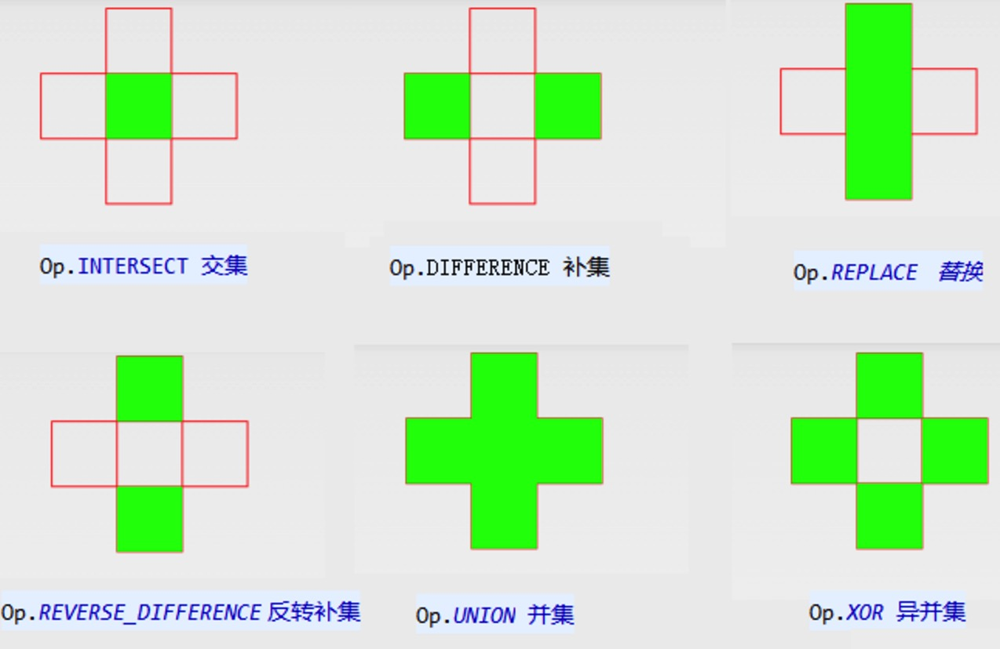

## 区域

绘图一定会牵涉到在画布上选区，牵涉到Region类，以下对Region类做一个简单的介绍

### 构造函数

 * public Region()

	创建一个空的区域

* public Region(Region region)

	拷贝一个region
* public Region(Rect r)

	创建一个矩形的区域

* public Region(int left, int top, int right, int bottom)

	创建一个矩形的区域
	
### 设置区域
*  public void setEmpty()  //置空
*  public boolean set(Region region)   
*  public boolean set(Rect r)   
*  public boolean set(int left, int top, int right, int bottom)   
*  public boolean setPath(Path path, Region clip) *//根据路径的区域与某区域的交集，构造出新区域*

> * Path path：用来构造的区域的路径
> * Region clip：与前面的path所构成的路径取交集，并将两交集设置为最终的区域

--
### 了解RegionIterator

> an iterator for all of the rectangles in a region. This effectively makes a private copy of the region, so any subsequent edits to region will not affect the iterator.

* public RegionIterator(Region region); 构造函数

* public final boolean next(Rect r) 

> Return the next rectangle in the region. 
> 
> * If there are no more rectangles this returns false and r is unchanged. 
> * If there is at least one more, this returns true and r is set to that rectangle.

example：

	private void drawRegion(Canvas canvas,
							Region rgn,Paint paint) {  
	    RegionIterator iter = new RegionIterator(rgn);  
	    Rect r = new Rect();  
	      
	    while (iter.next(r)) {  
	      canvas.drawRect(r, paint);  
	    }   
	} 
--

### 区域操作

合并

* public final boolean union(Rect r)

利用其他区域操作：
  
* public boolean op(Rect r, Op op) {  
* public boolean op(int left, int top, int right, int bottom, Op op)   
* public boolean op(Region region, Op op)   
* public boolean op(Rect rect, Region region, Op op)   

记原有区域为Region1，配合区域为Region2
   
> enum Op:
> --
> * DIFFERENCE(0)
>
> 	最终区域为region1 与 region2不同的区域
>
> * INTERSECT(1)
> 
> 	最终区域为region1 与 region2相交的区域
> 
> * UNION(2)
> 
> 	最终区域为region1 与 region2组合一起的区域
> 
> * XOR(3)
> 
> 	最终区域为region1 与 region2相交之外的区域
> 
> * REVERSE_DIFFERENCE(4)
> 
> 	最终区域为region2 与 region1不同的区域
> 
> * REPLACE(5)
> 
> 	最终区域为为region2的区域    
 
   

---