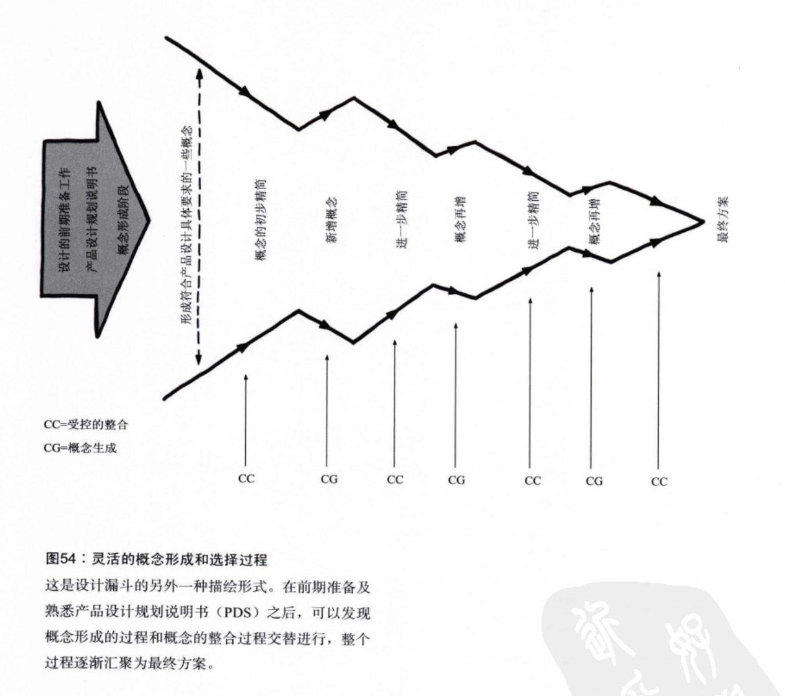

# 第一部分 设计成就梦想
## 语录
> 符号是思维的工具。能够被完美诠释的问题，在很大程度上已经被解决了
> 
> 科技不一定好，也不一定坏，但一定会分出好坏
> 
> 离开深思熟虑的设计，科技产品势必弊大于利
> 
> 使用含糊是为了激发灵感而不是说教，是为其披上神秘色彩而避免直白
> 
> 开局受挫，步步受挫
> 
> 你越避免冒险和探索，只坚持自己已经知道的东西，你就离心中的事业越远
> 
> 设计中没有愚蠢的提问，也没有被视为疯狂的想法，有想法就提出来，即使是不成熟的想法，说不定就会引发有意义的内容
> 
> 

## 概念
	设计的定义：
> 作者也难以在一开始就正面回答这一问题，“那些深入学习过设计的人、专业的人所认为的设计就是设计”这一解释也没有表现力。转而讨论何为设计？设计的原型活动是什么？——绘制草图；但设计不等同于绘制草图；

> 中篇时，作者给出如下定义：**设计即选择，其中有两个地方可以为创造性提供空间：**
> 
1. 在列举各种迥然不同的设计草案以供选择时可以表现出的创造性
2. 在定义选择的标准或准则时可以表现出的创造性

> 设计即折中 ：团队的各个部门都有合理的需求，一般都会有所冲突，设计就是要找到折中的方案

---
	

	
## 论点
* 我们在设计器具的工作中，必需倾尽全力，透彻理解其发挥功能的环境和社会情境
* 设计的原型活动应该是绘制草图
* “人人皆是设计师”这一说法有点欠妥，但是推崇“参与式设计”，在这一模式中，人人都可能参与设计过程
* 清晰并非总能使人明了
* 体验设计是以人为中心的；现在我们的文化大多是以技术和物质为中心的，但最终还是人而不是物品去体验这些设计成果
* 草图不是原型
* 设计的成功进行取决于沟通，而理解设计理念是其中重要一环
* 衡量任何一代技术设计的标准就是看它是否能解决上一代技术所带来的问题，并同时保留其给我们带来的好处
* 理解一个好点子和想出一个好点子所需的创造力一样多
* 好的创意需要实践

## 摘要
	草图的一些有关特征：
* 迅捷性
* 及时性：一有需求，立即绘制
* 廉价性
* 可弃性
* 丰富性
* 清晰的风格
* 独特的姿态：自由开放的风格，不同于工程制图那样精密准确
* 最小化细节：只包含表达设计目的或者理念的必要细节
* 合适的细致程度
* 建议、探索而不是确定
* 含糊性

---
	草图互动：
草绘的重点是活动本身，不是最后的图作。

体验是动态、复杂和主观的过程，他依赖对设计的多层次感知，根据环境对内容进行筛选理解。

---
	草图和原型的渐变

---
	相互重叠的漏斗形设计过程
	
两个相反的漏斗叠加起来描述了设计过程

最终的想法总比开始时要少

补充一个图：

---

再一种把设计看做漏斗的看法：

---

--

# 第二部分 方法与发狂的故事

## 语录
## 概念
## 论点
## 摘要
mark：p207，to be continue

	
